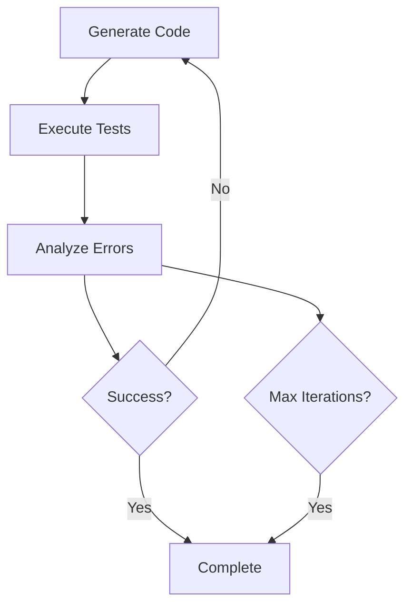

# AI Code Generation Agent

This project implements an AI-powered code generation agent using the NVIDIA NeMo Agent Toolkit, based on the [NVIDIA Developer Blog tutorial](https://developer.nvidia.com/blog/improve-ai-code-generation-using-nvidia-nemo-agent-toolkit/).

## 🎯 Overview

The agent uses a sophisticated **test-driven development** approach with multiple specialized AI models:

- **🧠 Reasoning LLM**: DeepSeek-R1 for error analysis and debugging insights
- **💻 Code Generation LLM**: Qwen2.5-Coder-32B for generating Python solutions  
- **🔄 Iterative Workflow**: LangGraph-based multi-step process with feedback loops

## 🏗️ Architecture

The agent follows a **LangGraph workflow** with three main nodes:



### Workflow Steps:
1. **Code Generation**: Uses Qwen2.5-Coder to generate Python solutions
2. **Test Execution**: Runs generated code against unit tests in an isolated sandbox
3. **Error Analysis**: Uses DeepSeek-R1 to analyze failures and provide debugging insights
4. **Iteration**: Repeats until tests pass or maximum attempts reached

## 📁 Project Structure

```
code_gen_agent_proper/
├── src/
│   └── code_gen_agent_proper/
│       ├── __init__.py
│       ├── register.py                    # Registration module
│       └── code_gen_agent_proper_function.py  # Main agent implementation
├── configs/
│   └── config.yml                         # AIQ configuration
├── test_examples/
│   ├── rectangle_tests.py                 # Example test cases
│   └── rectangle_solution.py              # Example solution file
├── eval_config.yml                        # Evaluation configuration
├── dataset.jsonl                          # Example dataset
├── requirements_minimal.txt               # Dependencies (recommended)
├── .env.example                           # Environment variables template
├── test_agent.py                          # Demo/test script
├── pyproject.toml                         # Package configuration
└── README.md                              # This file
```

## 🚀 Installation & Setup

### Prerequisites
- Python 3.8+
- NVIDIA API access

### Installation

1. **Create a new virtual environment**:
   ```bash
   python -m venv code_gen_env
   source code_gen_env/bin/activate  # On Windows: code_gen_env\Scripts\activate
   ```

2. **Install dependencies**:
   ```bash
   # Install from requirements file (contains all necessary dependencies)
   pip install -r requirements_minimal.txt
   
   # OR install manually:
   pip install aiqtoolkit[langchain] langchain langgraph python-dotenv
   ```

3. **Install this project in editable mode**:
   ```bash
   # IMPORTANT: This step is required for AIQ to recognize the workflow
   pip install -e .
   ```

4. **Set up environment variables**:
   ```bash
   # Copy the example file and add your API key
   cp .env.example .env
   # Edit .env and replace 'your_nvidia_api_key_here' with your actual key
   export NVIDIA_API_KEY="your_nvidia_api_key"
   ```

5. **Verify installation**:
   ```bash
   aiq info component  # Should show 'code_gen_agent_proper'
   ```

## 🎮 Usage

### ⚠️ Important Note About AIQ Run
**`aiq run` does not work with this workflow** because this agent is designed for **batch processing**, not interactive chat. The workflow expects complete problem specifications and produces complete solutions in one execution cycle. This limitation was not addressed as the focus was on implementing the core code generation functionality.

### Method 1: AIQ Evaluation (Recommended)
**This is the primary way to use this workflow:**

Create a dataset file and run batch evaluation:
```bash
aiq eval --config_file eval_config.yml
```

The evaluation will:
- ✅ Generate code solutions iteratively
- ✅ Run comprehensive testing
- ✅ Provide detailed profiling and metrics
- ✅ Track token usage and performance

### Method 2: Direct Testing
Run the demo script to see the basic setup:
```bash
python test_agent.py
```

## 🧪 Example Problem

The included example solves the **"Largest Rectangle in Histogram"** problem:

**Problem**: Given an array of heights, find the area of the largest rectangle that can be formed.

**Test Cases**:
- Empty array → -1
- Single element → element value
- Complex histogram → optimal rectangle area

**Expected Algorithm**: Stack-based approach for O(n) efficiency

## ⚙️ Configuration

The `configs/config.yml` defines:

```yaml
llms:
  reasoning_llm:           # DeepSeek-R1 for analysis
    _type: nim
    model_name: deepseek-ai/deepseek-r1
  code_llm:                # Qwen2.5-Coder for generation
    _type: nim  
    model_name: qwen/qwen2.5-coder-32b-instruct

workflow:
  _type: code_gen_agent_proper
  reasoning_llm: reasoning_llm
  code_llm: code_llm
  max_iterations: 3
```

## 🔧 Key Features

### ✅ **Test-Driven Development**
- Iterative improvement based on test feedback
- Automatic test execution in sandboxed environment
- Comprehensive error reporting

### ✅ **Multi-Model Intelligence**  
- Specialized models for different cognitive tasks
- Reasoning model provides debugging insights
- Code model focuses on implementation

### ✅ **Robust Execution**
- Safe code execution in isolated processes
- Timeout handling for infinite loops
- Clean error propagation and analysis

### ✅ **AIQ Integration**
- Built-in performance tracking and profiling
- Standard AIQ workflow registration
- Optimized for batch evaluation (`aiq eval`)

### ✅ **Extensible Design**
- Easy to add new problem types
- Configurable iteration limits
- Pluggable LLM models

## 🚀 Extending the Agent

### Adding New Problems

1. **Create test files** with assert statements:
   ```python
   def test_my_function():
       assert my_function([1,2,3]) == expected_result
   ```

2. **Create initial solution files** (can be empty):
   ```python
   def my_function(input_data):
       # TODO: Implement
       pass
   ```

3. **Use the agent** with your problem statement and file paths

The agent will automatically:
- ✅ Generate solutions iteratively
- ✅ Run comprehensive testing  
- ✅ Provide detailed error analysis
- ✅ Iterate until success

### Customizing Models

Modify `configs/config.yml` to use different models:
- Any NIM-compatible endpoint
- Different reasoning/coding model combinations
- Adjustable parameters (max_tokens, temperature, etc.)

## 📊 Performance & Monitoring

- **Profiling**: All LLM calls tracked by AIQ profiler
- **Metrics**: Token usage, latency, success rates
- **Debugging**: Detailed logs for each workflow step
- **Iteration Tracking**: Progress through multiple attempts

## 🛠️ Troubleshooting

### Common Issues

1. **"Workflow type 'code_gen_agent_proper' not found"**:
   ```bash
   # Make sure you installed the project in editable mode:
   pip install -e .
   
   # Verify it's registered:
   aiq info component  # Should show 'code_gen_agent_proper'
   ```

2. **API Key Issues**:
   ```bash
   echo $NVIDIA_API_KEY  # Should not be empty
   # Or check your .env file has the correct key
   ```

3. **Dependencies Missing**:
   ```bash
   # Make sure you're in the correct virtual environment
   pip install -r requirements_minimal.txt
   pip install -e .
   ```

4. **"aiq run doesn't work"**:
   - This is expected! Use `aiq eval` instead
   - The workflow is designed for batch processing only

5. **Test Execution Fails**:
   - Check file paths are absolute
   - Ensure test files have proper assert statements
   - Verify solution file is writable

## 📄 Notes

- Requires valid NVIDIA API keys for NIM endpoints
- Must run `pip install -e .` after installing dependencies
- Test execution runs in isolated Python subprocesses  
- Maximum iterations configurable (default: 3)
- All operations are logged and can be monitored
- **Use `aiq eval` for running the workflow** - `aiq run` is not supported
- Designed for batch processing, not interactive chat

## 🎉 Success Example

When working correctly, you'll see output like:
```
✅ Code generation successful!

Final solution saved to: /path/to/rectangle_solution.py

Test results: PASS: All tests passed!
✅ Test 1 passed: Empty array
✅ Test 2 passed: Single element  
✅ Test 3 passed: Classic example
🎉 All tests passed!
```

---

**Based on**: [NVIDIA Developer Blog Tutorial](https://developer.nvidia.com/blog/improve-ai-code-generation-using-nvidia-nemo-agent-toolkit/)

**Framework**: NVIDIA NeMo Agent Toolkit (AIQ) 